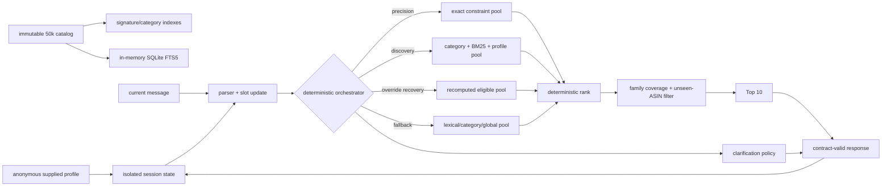

# IntentCart

**A stateful conversational shopping copilot that turns vague or changing intent
into ranked, catalog-valid recommendations within a ten-turn budget.**

IntentCart is our TechJam 2026 Track 4 submission for the frozen 50,000-product
Amazon Reviews 2023 clothing catalog. It implements the organizer's exact Python
`Agent` interface and can recommend ten products while asking a structured
clarification question in the same turn.

> **Verified release status:** Agent implementation commit `0ea7705` passes
> 26/26 tests and scores **0.890571** on the 200-session public development set,
> with 100% Hit@10 in every scenario. Two full runs produced byte-identical JSON.
> The final release tag is `submission-v1`; resolve its exact immutable commit
> with `git rev-parse submission-v1` after the release is published.

## Why conversational search

Static keyword search assumes the shopper can express the complete need in one
query. That assumption fails when a shopper begins with “I'm still exploring,”
adds requirements over several turns, or replaces an earlier preference. This
challenge is therefore a sequential decision problem, not only document search.

Each turn jointly decides:

1. which products are most likely to satisfy the current intent;
2. which unseen alternatives add useful coverage; and
3. which clarification can reduce uncertainty before the ten-turn limit.

Recommendation rank controls MRR, later conversion is penalized by MTTC, and a
question still consumes a turn. IntentCart consequently asks and recommends in
the same response.

| Scenario | Customer behavior | IntentCart behavior |
|---|---|---|
| Buying | Gives a category and hard requirement early | Selects the precision route and protects exact constraint matches |
| Browsing | Starts vague | Selects discovery, uses profile context softly, broadens recall, and covers product families |
| Intent Override | Replaces an earlier preference | Erases only stale evidence and starts a new recommendation-eligibility epoch |
| Boundary | Declines a preference | Treats the answer as neutral and retains a valid fallback |

## Architecture



### Catalog-derived precision

At initialization the Agent derives normalized intent signatures from catalog
titles, categories, features, details, store, description, and available price.
It builds reverse indexes for exact category and constraint lookup. Hard
constraints narrow the pool only when the intersection is non-empty, preventing
sparse or unknown metadata from collapsing recall.

Ranking is deterministic. Positional signature matches and anywhere-signature
matches precede category, lexical/profile signals, popularity, and ASIN
tie-breaking. The Agent never imports public targets, hidden intent cards, or
scenario labels.

### Explicit runtime routing

The orchestrator chooses one of four inspectable policies from observed state:

- `precision` for Buying with a hard constraint;
- `discovery` for Browsing;
- `override_recovery` after an explicit intent replacement; and
- `fallback` for incomplete or unexpected messages.

Policies differ in retrieval depth, profile use, diversity, clarification text,
and recovery behavior. Each decision records only safe operational facts—turn,
route, candidate count, question decision, and whether profile terms were used—
inside that session for tests and demos. Production code does not print profiles.

### Lexical recall and supplied-profile conditioning

SQLite FTS5 supplies BM25 recall over all 50,000 products. Queries combine the
current category, accumulated constraints, and current message. The documented
`preference_tags` and `summary` fields are deep-copied at `reset()`, distilled
into compact normalized terms, and used only as a soft discovery signal.

Profile context never hard-filters a product. After two explicit session
constraints, the lower-confidence profile terms are dynamically truncated so
current intent wins. No identity, demographics, raw history, or cross-session
memory is inferred or persisted.

### State, confidence, and override recovery

Every session owns its category, mode, ordered constraints, slot metadata,
profile context, route history, question history, candidate count, eligibility
epoch, and shown ASINs. Constraint metadata records value, source, confidence,
introduction/confirmation turn, and whether it is hard.

Explicit constraints do not decay. An override removes the named stale value,
preserves independent evidence, and increments the eligibility epoch. This lets
the Agent reconsider a product shown before the evaluator permits an Override
hit. “No preference” adds no negative slot.

### Clarification, family coverage, and failure behavior

When the candidate pool is larger than the returned list and another turn is
available, the Agent recommends and asks `ask_attribute="other"`. The official
simulator can disclose up to two still-hidden constraints for this attribute.
Turn 10 never asks an unusable follow-up.

Unconstrained discovery permits at most two products from one normalized
store/title family before covering another family, then backfills deterministically.
Once explicit constraints exist, precision takes priority and diversity cannot
displace a matching item. Shown ASINs are excluded within an eligibility epoch.

If exact lookup misses, the last non-empty pool survives. SQLite errors fall back
to deterministic category/global order, missing optional metadata is tolerated,
and response construction has a catalog-valid fallback.

### Why no external LLM or dense model

The official rules explicitly permit non-LLM agents. The frozen runtime uses
Python's standard library and SQLite FTS5, makes no network calls, and requires
no API key, vector database, GPU, downloaded model, or generated embedding asset.
Prompt and completion usage are honestly reported as zero, so estimated model
cost is US$0.

Dense retrieval and structured LLM reranking were not adopted because a
reproducible 50,000-item vector/model artifact, licensing, dependency footprint,
network failure path, and measurable score gain were not established. BM25 is
not described as dense or semantic retrieval.

## Repository layout

```text
.
├── starter/agent.py              production Agent entry point
├── demo.py                       reproducible Browsing/Override traces
├── DEMO_OUTPUT.md                captured end-to-end inference evidence
├── evaluator/local_evaluator.py  unmodified official evaluator
├── tests/test_agent.py           participant contract/state/routing tests
├── tests/test_evaluator.py       organizer evaluator tests
├── data/public_set.jsonl         200 public development sessions
├── data/catalog.jsonl            local decompressed catalog; Git-ignored
├── docs/                         official contract, rules, FAQ, and config
├── ABLATION.md                   commit-linked experiment record
├── NOTES.md                      audits, decisions, and measurement detail
├── DEVPOST.md                    copy-ready submission narrative
├── DEMO_SCRIPT.md                recording plan and safety checklist
├── DATA_ATTRIBUTION.md           dataset provenance and usage notes
├── requirements.txt              standard-library runtime declaration
└── SHA256SUMS                    official asset checksums
```

## Requirements

- Python 3.10 or later (verified with Python 3.12.5 and 3.12.14)
- Python's bundled SQLite with FTS5 enabled
- Approximately 60 MB for the decompressed catalog, plus in-memory indexes
- No GPU, API key, network service, third-party Python package, or paid model

Check FTS5:

```bash
python3 -c "import sqlite3; sqlite3.connect(':memory:').execute('CREATE VIRTUAL TABLE t USING fts5(x)'); print('FTS5 available')"
```

## Setup

```bash
git clone https://github.com/shang-yi-qian/shopping-copilot.git
cd shopping-copilot
python3 -m venv .venv
source .venv/bin/activate
python3 -m pip install -r requirements.txt
```

If `catalog.jsonl.gz` is not present, download it from the organizer's
[participant-kit release](https://github.com/TechJam2026/techjam-conversational-search/releases/tag/participant-kit).
Verify and decompress it:

```bash
# macOS
shasum -a 256 catalog.jsonl.gz

# Linux
sha256sum catalog.jsonl.gz

mkdir -p data
gzip -dc catalog.jsonl.gz > data/catalog.jsonl
```

The expected archive SHA-256 is
`07fd142631fd6b03e2b4d09988c3eb7d53720e9d57010c79db48eeaada50a8f8`.
The expected decompressed catalog SHA-256 is
`da979b05a68af864cb0dcf9ee6a81c010c7e66a57978ad286c7a2e005fc69a67`.
The Agent treats the catalog as immutable.

## Run, test, and demonstrate

```bash
# 23 participant tests + 3 organizer tests
python3 -m unittest discover -s tests -v

# Official public evaluator
python3 -m evaluator.local_evaluator --output results.json

# Readable Browsing and Intent Override traces
python3 demo.py
```

`results.json` is intentionally Git-ignored. Do not modify the catalog, public
labels, evaluation config, or evaluator when reproducing reported results.

## Public development results

These numbers are from the released 200-session public development set, not the
unreleased 800-session final set.

| Agent | Commit | Hit@10 | MRR | MTTC | Efficiency | TechnicalScore |
|---|---|---:|---:|---:|---:|---:|
| Organizer BM25 baseline | organizer release | 0.125000 | 0.068034 | 9.810000 | 0.119000 | 0.106710 |
| Stateful signature control | `00f1e41` | 1.000000 | 0.707655 | 2.120000 | 0.888000 | 0.889896 |
| IntentCart enhanced Agent | `0ea7705` | **1.000000** | **0.709905** | **2.120000** | **0.888000** | **0.890571** |

Scenario cells are `Hit@10 / MRR / MTTC`:

| Agent | Buying | Browsing | Intent Override | Boundary |
|---|---|---|---|---|
| Baseline | 0.237500 / 0.126508 / 8.625000 | 0.025000 / 0.004514 / 10.750000 | 0.133333 / 0.104167 / 10.066667 | 0.000000 / 0.000000 / 11.000000 |
| Control | 1.000000 / 0.697480 / 1.600000 | 1.000000 / 0.671657 / 1.962500 | 1.000000 / 0.811667 / 3.666667 | 1.000000 / 0.765000 / 2.900000 |
| Enhanced | **1.000000 / 0.703730 / 1.612500** | **1.000000 / 0.671032 / 1.950000** | **1.000000 / 0.811667 / 3.666667** | **1.000000 / 0.765000 / 2.900000** |

The enhanced build preserves 100% Hit@10 in every scenario. Buying MRR rises,
Browsing MTTC improves, and the small Browsing MRR change (-0.000625) is recorded
rather than hidden by the aggregate increase.

### Feasibility evidence

Measurements below are for `0ea7705` on an Apple M2 Pro MacBook Pro, 16 GB,
macOS 26.5.2 arm64, Python 3.12.5, and SQLite 3.45.3 with FTS5.

| Item | Measurement |
|---|---:|
| Catalog load | 0.395293 s |
| Agent initialization | 4.853555 s |
| Evaluation after setup | 9.080255 s |
| Cold evaluator wall time | 14.85 s |
| `respond()` calls | 424 |
| Mean response latency | 21.311968 ms |
| Median / P95 / maximum latency | 19.126250 / 41.749625 / 67.475958 ms |
| Maximum resident memory | 428,244,992 bytes (408.4 MiB) |
| Prompt / completion tokens | 0 / 0 |
| Estimated model cost | US$0 |
| Runtime network calls | 0 |

Two committed-build runs produced byte-identical JSON with SHA-256
`0faad255af1b1ad12fca5923fd124e0192594e88f348bc3e3bd5caa5f3cdad71`.
All 23 participant tests and 3 organizer tests pass. See [ABLATION.md](ABLATION.md)
and [NOTES.md](NOTES.md) for the full evidence trail.

## Verified multi-turn examples

Run `python3 demo.py` to reproduce both complete traces. The helper uses public
ground truth only to label the outcome after each response; the Agent never sees
it. [DEMO_OUTPUT.md](DEMO_OUTPUT.md) preserves the verified ranked predictions
and outcomes as a reviewable evidence artifact.

### Browsing — `public_0007`

- Turn 1 selects `discovery`, recommends ten unseen products, and asks `other`.
- The customer reveals `polyester` and a composition requirement.
- Profile terms are dynamically truncated once explicit evidence is sufficient.
- Turn 2 narrows 519 candidates to one exact candidate and finds the target at
  rank 1.

### Intent Override — `public_0003`

- Turn 1 stores the category and explicitly stale preference.
- Turn 2 reveals two valid requirements and contains the target at rank 1, but
  the evaluator correctly treats it as not yet eligible.
- Turn 3 explicitly replaces the old preference, selects `override_recovery`,
  increments the eligibility epoch, and finds the now-eligible target at rank 1.

## Ablation summary

The optional feature flags exist only to make the public ablation reproducible;
the evaluator uses both defaults (`enable_profile=True`,
`enable_diversity=True`). With the final routing thresholds:

| Variant | Hit@10 | MRR | MTTC | TechnicalScore |
|---|---:|---:|---:|---:|
| Profile off, diversity on | 1.000000 | 0.708571 | 2.120000 | 0.890171 |
| Profile on, diversity off | 1.000000 | 0.709488 | 2.120000 | 0.890446 |
| Both off | 1.000000 | 0.710155 | 2.125000 | 0.890547 |
| Both on (frozen default) | 1.000000 | 0.709905 | 2.120000 | **0.890571** |

The combined score gain over both-off is tiny; the features are retained because
they close judged requirements with direct deterministic tests, preserve every
scenario's Hit@10, and slightly improve turn efficiency. We make no claim that
this public-set difference is statistically significant.

## Limitations and next steps

- The parser intentionally supports the organizer's deterministic templates;
  real customer language needs paraphrase, typo, multilingual, and adversarial
  robustness evaluation.
- FTS5 and catalog signatures cannot infer every synonym or cross-category use
  case as a validated semantic model might.
- Profile tags are generic and are only a weak supplied prior, not learned or
  persistent personalization.
- Family is approximated from store or title; real commerce needs canonical
  brand/product-family identifiers.
- Price is populated for about 21% of rows, so it cannot be an unconditional
  hard filter.
- No untouched 40-session holdout was preserved before full-public iteration.
  We therefore make no holdout or private-set claim.
- IntentCart is a headless retrieval Agent, not a storefront, transaction
  system, or production policy/compliance layer.

Credible next work is a licensed, reproducible in-memory dense route; structured
semantic reranking with strict validation and cost/timeout fallback; broader
language testing; and information-gain estimation for specific questions. Each
must beat this frozen offline control before adoption.

## Data and asset attribution

The frozen `Clothing_Shoes_and_Jewelry` catalog and simulated sessions are
organizer-prepared derivatives of
[Amazon Reviews 2023](https://amazon-reviews-2023.github.io/) by McAuley Lab at
UC San Diego. They are not real shopping conversations. See
[DATA_ATTRIBUTION.md](DATA_ATTRIBUTION.md) for full attribution and usage notes.

- [Organizer participant repository](https://github.com/TechJam2026/techjam-conversational-search)
- [Participant-kit release](https://github.com/TechJam2026/techjam-conversational-search/releases/tag/participant-kit)
- [Final evaluation FAQ](docs/final_evaluation_faq.md)
- [Submission rules](docs/submission_rules.md)

The demo uses original terminal output and diagrams only—no product images,
storefront captures, logos, webinar footage, third-party video, or copyrighted
music.

## Team contributions

- **Tay Kai — Agent and integration lead:** catalog signatures, reverse indexes,
  retrieval/ranking, state and override behavior, explicit orchestration,
  profile conditioning, diversity, full integration, and freeze verification.
- **Yi Qian — Evaluation and delivery:** evaluator analysis, initial
  contract/state tests, catalog audits, ablation evidence, reproducibility
  documentation, and release handoff.
- **Both teammates:** architecture review, measured control selection, and
  submission narrative. Tay Kai completed the post-handoff W1/W2/W5 enhancement,
  final artifacts, and integrated release after Yi Qian stopped active work.

## Release and external publication

- Public repository: <https://github.com/shang-yi-qian/shopping-copilot>
- Frozen release tag: `submission-v1`
- Evaluation date: 2026-09-01 (Asia/Singapore)
- Catalog archive SHA-256:
  `07fd142631fd6b03e2b4d09988c3eb7d53720e9d57010c79db48eeaada50a8f8`
- Tests: 26/26 passed
- Public evaluator: Hit@10 1.0, MRR 0.709905, MTTC 2.12,
  TechnicalScore 0.890571
- External model/API: none; 0 tokens; US$0; no network dependency

Copy-ready Devpost content is in [DEVPOST.md](DEVPOST.md), and the complete
recording/runbook is in [DEMO_SCRIPT.md](DEMO_SCRIPT.md). The exact remaining
account actions are in [SUBMISSION_STEPS.md](SUBMISSION_STEPS.md). Publishing the
Devpost entry and YouTube video requires the team's external accounts; after
publication, place both public URLs in the Devpost form and verify them while
signed out.

After the submission deadline, run the released 800-session package only against
the immutable `submission-v1` tag with the official evaluator unchanged. Retain
the resulting JSON and environment record; never tune the Agent on private-set
results.
