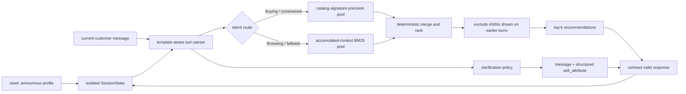

# IntentCart

**A stateful conversational shopping copilot that turns vague or changing intent
into ranked, catalog-valid recommendations within a ten-turn budget.**

IntentCart is our TechJam 2026 Track 4 submission. It is designed for the frozen
50,000-product Amazon Reviews 2023 clothing catalog and the organizer's exact
`Agent` interface. On each turn it can recommend up to ten products, ask one
structured clarification question, or do both.

> **Release-candidate status:** Agent commit `00f1e41` is independently verified
> at TechnicalScore 0.889896 and passes 24/24 tests. The remaining `PENDING_*`
> fields require the final integrated commit/tag, team names, and public URLs.
> Re-run the freeze gate after applying the delivery commit; do not relabel the
> RC hash as the integrated hash without that final run.

## The problem

Keyword retrieval works well when a shopper already knows what to type. It is
much weaker when the shopper starts with “I'm still exploring,” adds constraints
over several turns, or replaces an earlier preference. The challenge is therefore
not just document retrieval: it is sequential decision-making under a strict
turn budget.

The hidden target is a real parent product in the frozen catalog. A session ends
when that exact `parent_asin` appears in the scored top ten or after turn 10. The
four evaluator scenarios test different failure modes:

| Scenario | Customer behavior | Required Agent behavior |
|---|---|---|
| Buying | Gives a category and hard requirement early | Lock the constraint and rank precise matches immediately |
| Browsing | Starts vague | Recommend broadly while asking for useful missing information |
| Intent Override | Replaces an earlier preference | Erase only the stale value and preserve independent context |
| Boundary | Declines to provide a preference | Keep a valid fallback; never turn “no preference” into a hard negative |

## Key insight

Conversational shopping is a form of sequential experiment design. Every turn
must balance three jobs:

1. rank the strongest current candidates as highly as possible;
2. spend the remaining recommendation positions on useful, previously unseen
   coverage; and
3. ask for information that can shrink uncertainty without sacrificing the
   current turn's recommendations.

This matters because a question consumes a turn, recommendation rank controls
MRR, and a late hit is penalized by MTTC. IntentCart therefore asks and
recommends in the same response.

## Architecture



### 1. Catalog-signature precision route

At initialization the Agent derives normalized, catalog-only intent signatures
from titles, category paths, feature bullets, product details, store, and the
available description. It builds lightweight reverse indexes for exact category
and constraint matching. No public target labels are imported by the Agent.

When a hard requirement is present, exact signature evidence is preferred over
generic lexical overlap. Intersections are applied only when they remain
non-empty, so a sparse or unknown attribute cannot collapse retrieval.

### 2. Accumulated-context BM25 fallback

SQLite FTS5 provides deterministic lexical recall over the 50,000 catalog
records. Unlike the stateless starter, the retrieval query uses valid accumulated
session context rather than only the newest message. It remains a fallback when
exact indexes cannot identify enough candidates.

### 3. Dialogue state and override handling

Every session owns separate mutable state: category, ordered constraints,
scenario mode, copied profile context, question history, and already shown ASINs.
`reset()` creates a clean state for one session. An override removes the stated
old preference and adds its replacement without discarding unrelated constraints.
Because Intent Override targets cannot score before the explicit replacement
turn, that transition starts a new recommendation-eligibility epoch: candidates
shown too early may be considered again after the intent becomes scoreable.

The supplied anonymized profile is copied into isolated session state, but this
RC does **not** use profile tags or summaries to change ranking. We disclose this
boundary explicitly rather than calling storage alone “personalization.”

### 4. Clarification and coverage policy

If the candidate pool remains broad and another turn is available, the Agent asks
a natural multi-facet question while setting `ask_attribute` to `other`. This is
deliberate: the official simulator can reveal up to two undisclosed constraints
for `other`, whereas a specific attribute can reveal only matching classified
constraints. Turn 10 returns recommendations without an unusable follow-up.

The evaluator does not deduplicate across turns. IntentCart records shown ASINs
per session so a miss becomes evidence and later turns cover unseen candidates.

### 5. Deterministic, zero-model-cost release path

The sprint release uses Python's standard library and SQLite FTS5. It makes no
network calls and uses no external LLM, embedding API, or vector database. Usage
is reported as zero prompt and completion tokens. Popularity is only a final
tie-breaker after intent relevance; it never replaces matching evidence.

This is an intentional feasibility choice, not a claim that semantic models are
unhelpful. The organizer permits non-LLM solutions, and the frozen release favors
reproducibility over an unmeasured late dependency.

## Why the approach generalizes

- The Agent indexes only fields in the frozen catalog and never reads public
  targets or evaluator intent cards.
- No public target ASIN is hardcoded.
- The retrieval and state rules apply equally to the four published scenarios.
- Deterministic ordering makes failures reproducible and ablations meaningful.
- Exact matching is paired with a lexical fallback, so missing metadata does not
  eliminate all candidates.
- Three independent full runs of the selected RC produced byte-identical result
  JSON. This is public-development reproducibility evidence, not a private-set
  generalization claim.

## Repository layout

```text
.
├── starter/agent.py              production Agent entry point
├── evaluator/local_evaluator.py  unmodified official evaluator
├── tests/test_agent.py           participant contract/state tests
├── tests/test_evaluator.py       organizer evaluator tests
├── data/public_set.jsonl         200 public development sessions
├── data/catalog.jsonl            local decompressed catalog; Git-ignored
├── docs/                         official contract, rules, FAQ, and config
├── ABLATION.md                   commit-linked experiment record
├── NOTES.md                      evaluator facts and design rationale
├── DATA_ATTRIBUTION.md           dataset provenance and license notes
├── requirements.txt              runtime dependency declaration
└── SHA256SUMS                    official asset checksums
```

## Requirements

- Python 3.10 or later; this is required because the Agent uses slotted
  dataclasses (independent release validation used Python 3.12.14)
- A Python build with SQLite FTS5 enabled
- Approximately 60 MB free for the decompressed catalog, plus index space
- No GPU, API key, network service, or paid model
- Runtime Python dependencies: standard library only

Check FTS5 support with:

```bash
python3 -c "import sqlite3; sqlite3.connect(':memory:').execute('CREATE VIRTUAL TABLE t USING fts5(x)'); print('FTS5 available')"
```

## Setup

1. Clone the public repository and enter it:

   ```bash
   git clone PENDING_PUBLIC_REPOSITORY_URL
   cd shopping-copilot
   ```

2. Use an isolated Python environment. There are no third-party packages to
   download, but isolation records the interpreter used for evaluation:

   ```bash
   python3 -m venv .venv
   source .venv/bin/activate
   python3 --version
   python3 -m pip install -r requirements.txt
   ```

3. Download `catalog.jsonl.gz` from the organizer's
   [participant-kit release](https://github.com/TechJam2026/techjam-conversational-search/releases/tag/participant-kit)
   if it is not included in the repository.

4. Verify the exact catalog archive. The digest must be:
   `07fd142631fd6b03e2b4d09988c3eb7d53720e9d57010c79db48eeaada50a8f8`.

   macOS:

   ```bash
   shasum -a 256 catalog.jsonl.gz
   ```

   Linux:

   ```bash
   sha256sum catalog.jsonl.gz
   ```

5. Decompress the read-only catalog into its ignored runtime location:

   ```bash
   mkdir -p data
   gzip -dc catalog.jsonl.gz > data/catalog.jsonl
   ```

The Agent treats `data/catalog.jsonl` as immutable. Do not edit the catalog,
public labels, or evaluator when producing reported results.

## Run and reproduce

Run all organizer and participant tests:

```bash
python3 -m unittest discover -s tests -v
```

Run the unmodified official public evaluator:

```bash
python3 -m evaluator.local_evaluator --output results.json
```

Optionally record wall-clock runtime separately:

```bash
/usr/bin/time -p python3 -m evaluator.local_evaluator \
  --output /tmp/intentcart-public-results.json
```

The evaluator initializes `Agent(data/catalog.jsonl)`, calls `reset()` once per
session, and calls `respond()` for at most ten turns. `results.json` contains
aggregate and per-session evidence and is intentionally Git-ignored.

## Public development results

These results are from the released 200-session public development set. They are
not private/final-set claims. Person B independently reproduced both the baseline
and Agent RC with the unmodified official evaluator. The selected RC changes only
`starter/agent.py` relative to its parent.

| Agent | Commit | Hit@10 | MRR | MTTC | Efficiency | TechnicalScore |
|---|---|---:|---:|---:|---:|---:|
| Organizer BM25 baseline | `02f15cd` | 0.125000 | 0.068034 | 9.810000 | 0.119000 | 0.106710 |
| IntentCart Agent RC | `00f1e41` | 1.000000 | 0.707655 | 2.120000 | 0.888000 | 0.889896 |

Scenario cells are `Hit@10 / MRR / MTTC`:

| Agent | Buying | Browsing | Intent Override | Boundary |
|---|---|---|---|---|
| Baseline | 0.237500 / 0.126508 / 8.625000 | 0.025000 / 0.004514 / 10.750000 | 0.133333 / 0.104167 / 10.066667 | 0.000000 / 0.000000 / 11.000000 |
| IntentCart RC | 1.000000 / 0.697480 / 1.600000 | 1.000000 / 0.671657 / 1.962500 | 1.000000 / 0.811667 / 3.666667 | 1.000000 / 0.765000 / 2.900000 |

Release environment and feasibility disclosure:

| Item | Frozen measurement |
|---|---|
| Python version | 3.12.14 |
| SQLite | 3.53.4 with FTS5 |
| Hardware / operating system | Apple M4 MacBook Pro, 16 GB, macOS 15.5 arm64 |
| Agent initialization time | 7.785188 s |
| Independent cold evaluator wall time | 20.85 s (`user` 20.45, `sys` 0.25) |
| Partner handoff runtime | approximately 13 s; retained as a separate environment measurement |
| Average response latency | 28.880855 ms over 424 calls |
| Median / P95 / maximum response latency | 26.362625 / 62.312896 / 110.095083 ms |
| Maximum resident memory | 416,415,744 bytes (397.125 MiB) |
| External network calls | 0 |
| Model/API | None |
| Prompt / completion tokens | 0 / 0 |
| Estimated model cost | US$0 |

The independently saved RC result JSON has SHA-256
`980e6288c63e2222cd85d21051df1a7238bacdbe294bdf5033a2059678a58829`.
Organizer tests passed 3/3 and participant Agent tests passed 21/21 under the
same RC. Three full evaluator runs produced byte-identical JSON. See
[NOTES.md](NOTES.md) for the exact environment and audit trail.

See [ABLATION.md](ABLATION.md) for the full commit-linked experiment log and
[NOTES.md](NOTES.md) for the evidence behind design choices.

## Verified multi-turn examples

These condensed traces were captured from Agent RC `00f1e41` with the official
public simulator policy. Product identifiers are omitted from the README; the
saved evaluator result retains the exact scored evidence.

### Browsing — `public_0007`

```text
Turn 1 customer:
  I'm looking for Tees & Blouses Tunics, but I'm still exploring.

Turn 1 Agent:
  returns 10 ranked category/BM25 candidates
  asks what requirement matters most
  ask_attribute=other
  target is not in the scored Top 10

Turn 2 customer:
  For that, what matters is: polyester; 75% Polyester, 20% Rayon, 5% Spandex.

State before ranking:
  mode=browsing
  category=tees & blouses tunics
  constraints=[polyester, "75% polyester, 20% rayon, 5% spandex"]
  turn-1 ASINs remain excluded

Turn 2 Agent:
  returns the target at rank 1
  ask_attribute=None because the narrowed pool is already confident
  session stops successfully
```

### Intent Override — `public_0003`

```text
Turn 1 customer supplies category Watches Wrist Watches and an old preference.
Agent saves the old preference as stale context, asks other, and recommends.

Turn 2 customer reveals Water Resistant and 3 Year Battery.
The target appears at rank 1, but the evaluator correctly does not score it yet.

Turn 3 customer explicitly replaces the earlier preference with Water Resistant.
Agent starts a new eligibility epoch, preserves valid context, ranks the target
at 1 again, and the evaluator records the conversion on turn 3.
```

## Limitations

- Exact target recovery is difficult when many parent products have nearly
  identical generic metadata.
- Standard-library lexical retrieval cannot infer every synonym or subtle
  cross-category use case as well as a validated semantic model might.
- The parser intentionally targets the organizer's published deterministic
  message templates; free-form real-customer language would require broader
  robustness testing.
- The anonymized profile is isolated and retained but is not used for ranking in
  this RC. Supplied-profile conditioning requires a separate measured ablation.
- Price is present for only about 21% of catalog rows, so price cannot be a safe
  unconditional hard filter.
- Public-set improvements may not transfer perfectly to the unreleased final
  set. The frozen build cannot be tuned after final labels are released.
- The team did not preserve an untouched 40-session public holdout before the
  full public set had been evaluated. We therefore make no holdout claim; the
  separate 800-session final set is the true generalization check.
- IntentCart is a headless retrieval Agent, not a production storefront,
  transaction system, or safety/compliance layer.

## What we would improve with more time

1. Add catalog-derived dense retrieval and validate its incremental value with a
   frozen local model and reproducible artifact build.
2. Learn posterior calibration and route thresholds without using evaluation
   targets inside Agent logic.
3. Expand parser tests to paraphrases, misspellings, and multilingual requests.
4. Estimate information gain for specific clarification attributes rather than
   relying on the simulator-efficient `other` route.
5. Build a privacy-preserving preference memory with explicit user controls and
   decay policies for real-world use.
6. Add a lightweight service/UI only after the headless retrieval contract is
   stable and measured.

## Data and asset attribution

The frozen `Clothing_Shoes_and_Jewelry` catalog and sessions are
organizer-prepared derivatives of
[Amazon Reviews 2023](https://amazon-reviews-2023.github.io/) by McAuley Lab at
UC San Diego. Session intents are simulated from catalog metadata and a
deterministic scenario policy; they are not real shopping conversations. See
[DATA_ATTRIBUTION.md](DATA_ATTRIBUTION.md) for the full attribution and usage
notes.

Official participant resources:

- [Participant repository](https://github.com/TechJam2026/techjam-conversational-search)
- [Participant-kit release](https://github.com/TechJam2026/techjam-conversational-search/releases/tag/participant-kit)
- [Final evaluation FAQ](docs/final_evaluation_faq.md)
- [Submission rules](docs/submission_rules.md)

## Team contributions

Replace the names below before publishing; preserve the concrete ownership split.

- **`PENDING_PERSON_A_NAME` — Agent engineering:** catalog-derived signatures,
  reverse indexes, retrieval/ranking, dialogue state, override behavior,
  clarification policy, and production `starter/agent.py` integration.
- **`PENDING_PERSON_B_NAME` — Evaluation and delivery:** evaluator analysis,
  contract/state tests, catalog audits, ablation evidence, reproducible
  setup, README, Devpost copy, demo script, and release/submission verification.
- **Both teammates:** architecture selection, release-candidate review, frozen
  evaluation, demo rehearsal, and final submission audit.

## Frozen release record

Complete this block at code freeze and keep the generated evidence with the
submission:

```text
Frozen commit: PENDING_FINAL_SHA
Frozen tag: PENDING_FINAL_TAG
Evaluation date/time/timezone: PENDING
Catalog SHA-256: 07fd142631fd6b03e2b4d09988c3eb7d53720e9d57010c79db48eeaada50a8f8
Official tests: PENDING
Participant tests: PENDING
Evaluator result: PENDING
Public repository: PENDING_PUBLIC_REPOSITORY_URL
Public demo video: PENDING_PUBLIC_VIDEO_URL
Devpost: PENDING_DEVPOST_URL
```

After the submission deadline, run the released 800-session package only against
this frozen commit with the official evaluator unchanged. Retain the resulting
JSON and environment record; do not update the Agent in response to private-set
results.
